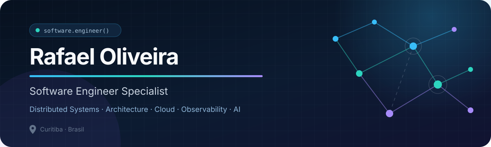

  

  
  

## Olá, eu sou o Rafael

**Engenheiro de Software Especialista** com experiência na construção de produtos, plataformas e sistemas distribuídos — do backend e frontend à infraestrutura de aplicações.

Atualmente atuo no **Grupo Boticário**, combinando desenvolvimento hands-on com arquitetura de soluções, análise de trade-offs, evolução de padrões, observabilidade, confiabilidade e apoio técnico aos times.

> Não parto de uma linguagem ou framework. Parto do problema, das restrições do sistema e dos trade-offs do contexto.

### No que estou focado

- Arquitetura de software, DDD e Clean Architecture
- Sistemas distribuídos e arquiteturas orientadas a eventos
- Cloud, engenharia de plataforma e developer experience
- Observabilidade, confiabilidade e segurança
- IA aplicada à engenharia: LLMs, agentes e automações

## Stack & ferramentas

  <strong>Linguagens</strong>  
  
  
  
  
  

  <strong>Aplicações & APIs</strong>  
  
  
  
  
  
  

  <strong>Cloud, plataforma & dados</strong>  
  
  
  
  
  
  
  
  
  

## Projeto em destaque

### [Finora](https://github.com/blasther12/finora)

**Clareza para entender hoje. Projeções para decidir amanhã.**

Gerenciador financeiro pessoal full-stack orientado a estado financeiro, orçamento e projeções — construído como produto, não apenas como um CRUD.

- Monorepo com Next.js, NestJS e contratos compartilhados
- PostgreSQL, Prisma, Swagger, Docker e health checks
- Modelagem financeira com precisão monetária e regras de domínio
- Testes, migrations e pipeline automatizado de releases

## Trajetória recente

| Período | Atuação |
| --- | --- |
| **2026 — atual** | Developer Specialist I · Grupo Boticário |
| **2025 — 2026** | Senior Software Engineering · Luizalabs |
| **2024 — 2025** | Senior Software Engineering · Magalu Cloud |
| **2022 — 2024** | Back-end Developer · Luizalabs |
| **2018 — 2022** | Full-stack, APIs, dados e sistemas corporativos |

## Formação

- **Especialização em Engenharia de Software** — PUC Minas
- **Bacharelado em Sistemas de Informação** — Universidade Positivo

## Escrevendo sobre

Arquitetura de software, sistemas distribuídos, observabilidade, cloud, developer experience e IA aplicada ao ciclo de desenvolvimento.

   
  <strong>Software melhor nasce de contexto, escolhas explícitas e ciclos curtos de aprendizado.</strong>
    
  <a href="mailto:rafaoli1212@outlook.com">Vamos conversar</a>
  ·
  <a href="https://www.linkedin.com/in/rafael-oliveira-44b701160/">LinkedIn</a>

